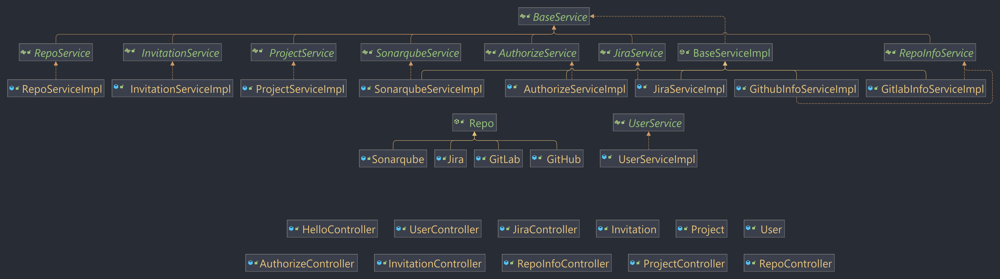
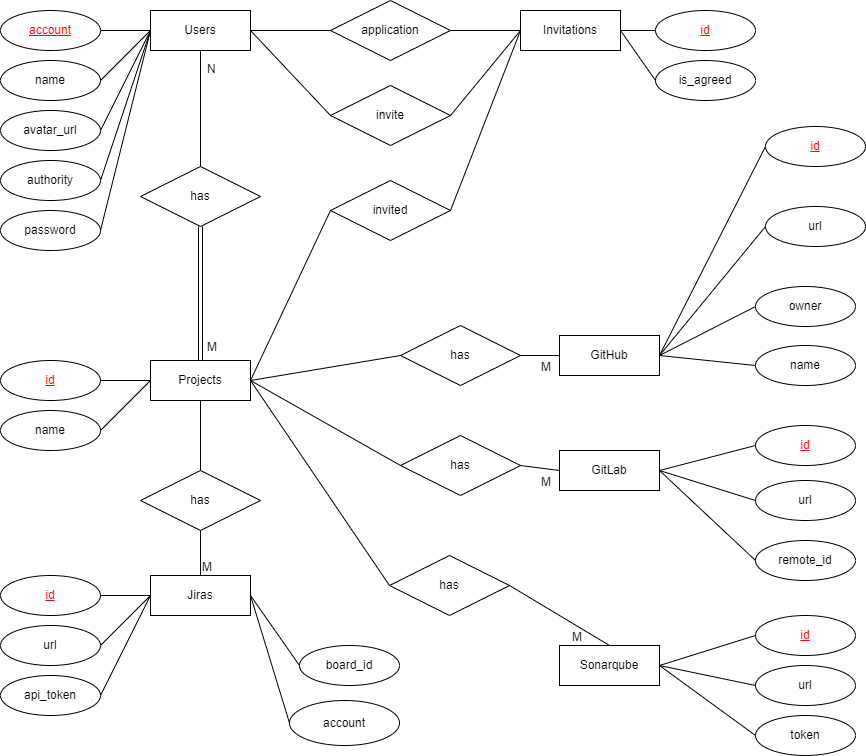

# PDD (Project Development Dashboard) Backend

## Information
| Type               | Value                     |
|--------------------|---------------------------|
| SDK                | Amazon Corretto-11        |
| Language level     | 11                        |
| Test               | Junit4 + Junit5 + Mockito |
| Management Tool    | Gradle                    |
| Software Framework | Spring Boot               |
| IDE                | IntelliJ IDEA             |

## Project Build

- 使用 Intellij IDEA 打開此專案，會自動檢測並下載專案所需的依賴套件
- 前往 File -> Project Structure -> Project Settings -> Project
  - 將 SDK 設定為 Amazon Corretto-11 或 openjdk-11 (若沒有則按Add SDK -> Download JDK, 以下載所需的JDK)
  - 將 Language level 設定為 11
- 前往 File -> Project Structure -> Project Settings -> Modules
  - 將此專案的 Language level 設定為 Project default (11)
- 前往 File -> Settings -> Build, Execution, Deployment -> Build Tools -> Gradle
  - 將 Build and run using 和 Run tests using 改成 IntelliJ IDEA
  - 將 Gradle JVM 調整成 Amazon Corretto-11
- 前往 File -> Settings -> Build, Execution, Deployment -> Compiler -> Java Compiler
  - 將 Use compiler 設定為 Javac
  - 將 Project bytecode version 設定為 11
- 前往 File -> Invalidate Caches
  - 點選 Invalidate and Restart，清除快取並重新啟動 IntelliJ IDEA
- 執行 Gradle 指令 build

## Run Project

- 運行專案的 Application.java，來啟動 Tomcat 伺服器
- 接著可透過 https://localhost:5005/ 來發送 API 請求
  - 前往 https://localhost:5005/hello ，你應該可以看到 `Hello World!` 的文字

# Change log

## 111-1

### Class Diagram

### Bean

按照 ER 圖重建 Bean 之間的關係。

- ER 圖
  

### Controller

完成 (Test Coverage **unknown**)

1. AuthorizeController
2. InvitationController
3. ProjectController
4. RepoController
5. RepoInfoController
6. UserController

未完成

1. JiraController

### Service

完成 (Test Coverage **100%**)

1. AuthorizeServiceImpl
2. GithubInfoServiceImpl
3. InvitationServiceImpl
4. ProjectServiceImpl
5. RepoServiceImpl
6. SonarqubeServiceImpl

未完成

1. GitlabInfoService
2. JiraServiceImpl

# Coding Style

## Naming

### DTO

如果 DTO 是用來**接收前端**傳過來的參數的話，需要加上前綴 "Request"。  
_e.g., `RequsetRepoInfoDto`, `RequestGithubLoginDto`_

如果 DTO 是用來儲存**回傳給前端**資料的話，需要加上前綴 "Response"。  
_e.g., `ResponseIssuesDto`, `ResponseUserInfoDto`_

# FAQ

### 前端遇到發送 API 時，遇到 CORS Failed。

先連線到 [https://localhost:5005/hello](https://localhost:5005/hello) 來手動**同意瀏覽器連線到不安全的網站**，再回到前端重新發送
API 即可成功連線。
